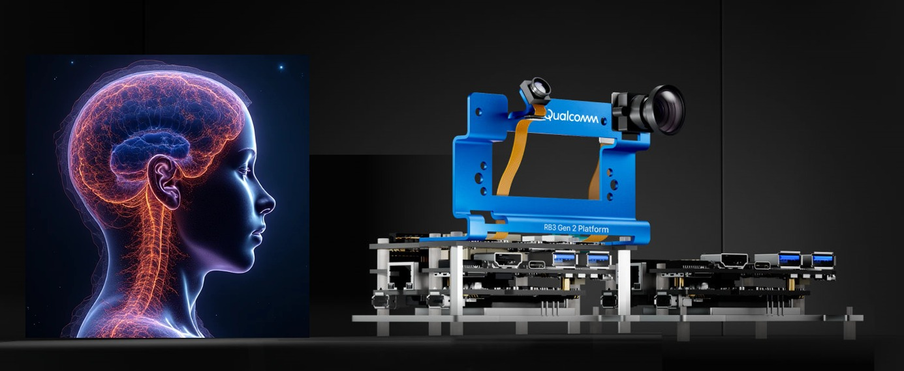
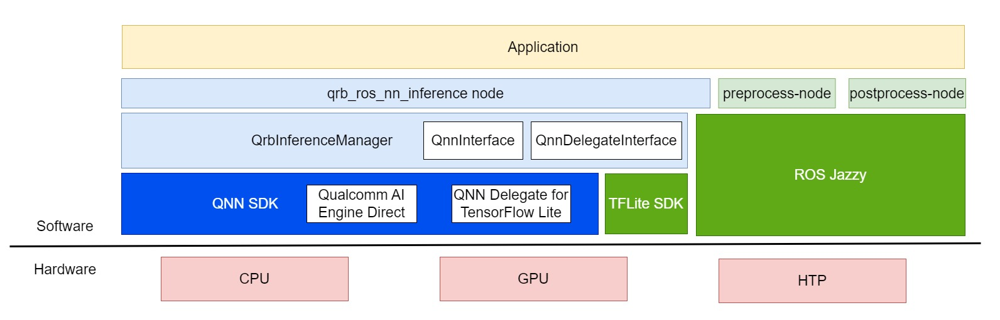

<div align="center">
  <h1>QRB ROS NN Inference</h1>
  <p align="center">
   
  </p>
  <p>ROS2 package for performing neural network model</p>
  <a href="https://ubuntu.com/download/qualcomm-iot" target="_blank"></a>
  <a href="https://docs.ros.org/en/jazzy/" target="_blank"></a>
</div>

---

## 👋 Overview

> WARNING: The inference of TFLite model is NOT supported on version 1.1.0-jazzy.

**qrb_ros_nn_inference** is a ROS2 package for performing neural network model, providing 🤖AI-based perception for robotics applications. It provides:
- ✨model inference API which supports three kinds of model format: **.tflite**, **.so**, **.bin**
- 🚀model inference acceleration based on Qualcomm platforms

<div align="center">
  
</div>

<br>

**qrb_ros_nn_inference** is a ROS2 package based on [qrb_inference_manager](./qrb_inference_manager/README.md) which is a C++ library encapsulates the APIs of [Qualcomm AI Engine Direct](https://docs.qualcomm.com/bundle/publicresource/topics/80-63442-50/overview.html) and [QNN Delegate for TensorFlow Lite](https://docs.qualcomm.com/bundle/publicresource/topics/80-63442-2/overview.html).

**qrb_ros_nn_inference** receives data from a specific topic, then without any processing, directly uses the received data for model inference. Afterwards, the results of the model inference are sent out directly through another specific topic.

---

## 🔎 Table of Contents
  * [APIs](#-apis)
    * [`qrb_ros_nn_inference` APIs](#-qrb_ros_nn_inference-apis)
    * [`qrb_inference_manager` APIs](#-qrb_inference_manager-apis)
  * [Supported Targets](#-supported-targets)
  * [Installation](#-installation)
  * [Usage](#-usage)
  * [Build from Source](#-build-from-source)
  * [Contributing](#-contributing)
  * [License](#-license)

---

## ⚓ APIs

### 🔹 `qrb_ros_nn_inference` APIs

#### ROS node parameters

<table>
  <tr>
    <th>Parameter</th>
    <th>Type</th>
    <th>Default Value</th>
    <th>Description</th>
  </tr>
  <tr>
    <td>backend_option</td>
    <td>string</td>
    <td>""</td>
    <td>Hardware acceleration option for model inference, vaild values are listed <a href="https://github.com/qualcomm-qrb-ros/qrb_ros_nn_inference/blob/main/qrb_inference_manager/Documentation.md#2.1" target="_blank">here</a></td>
  </tr>
  <tr>
    <td>model_path</td>
    <td>string</td>
    <td>""</td>
    <td>Path of model file</td>
  </tr>
</table>

#### ROS topics

<table>
  <tr>
    <th>Topic Name</th>
    <th>Message Type</th>
    <th>Description</th>
  </tr>
  <tr>
    <td>qrb_inference_input_tensor</td>
    <td><a href="https://github.com/qualcomm-qrb-ros/qrb_ros_interfaces/blob/main/qrb_ros_tensor_list_msgs/msg/TensorList.msg" target="_blank">TensorList</a></td>
    <td>Subscribed topic</td>
  </tr>
  <tr>
    <td>qrb_inference_output_tensor</td>
    <td><a href="https://github.com/qualcomm-qrb-ros/qrb_ros_interfaces/blob/main/qrb_ros_tensor_list_msgs/msg/TensorList.msg" target="_blank">TensorList</a></td>
    <td>Published topic</td>
  </tr>
</table>

### 🔹 `qrb_inference_manager` APIs

Please see [qrb_inference_manager APIs](./qrb_inference_manager/Documentation.md).

---

## 🎯 Supported Targets

<table >
  <tr>
    <th>Development Hardware</th>
    <th>Hardware Overview</th>
  </tr>
  <tr>
    <td>Qualcomm Dragonwing™ RB3 Gen2</td>
    <th><a href="https://www.qualcomm.com/developer/hardware/rb3-gen-2-development-kit"></a></th>
  </tr>
    <tr>
    <td>Qualcomm Dragonwing™ IQ-9075 EVK</td>
    <th><a href="https://www.qualcomm.com/products/internet-of-things/industrial-processors/iq9-series/iq-9075"></a></th>
  </tr>
</table>

---

## ✨ Installation

> [!IMPORTANT]
> **PREREQUISITES**: The following steps need to be run on **Qualcomm Ubuntu** and **ROS Jazzy**.<br>
> Reference [Install Ubuntu on Qualcomm IoT Platforms](https://ubuntu.com/download/qualcomm-iot) and [Install ROS Jazzy](https://docs.ros.org/en/jazzy/index.html) to setup environment. <br>
> For Qualcomm Linux, please check out the [Qualcomm Intelligent Robotics Product SDK](https://docs.qualcomm.com/bundle/publicresource/topics/80-70018-265/introduction_1.html?vproduct=1601111740013072&version=1.4&facet=Qualcomm%20Intelligent%20Robotics%20Product%20(QIRP)%20SDK) documents.

> Note: The GPU hardware acceleration is not support on Ubuntu Desktop<br>

Add Qualcomm IOT PPA for Ubuntu:

```bash
sudo add-apt-repository ppa:ubuntu-qcom-iot/qcom-noble-ppa
sudo add-apt-repository ppa:ubuntu-qcom-iot/qirp
sudo apt update
```

Install Debian package:

```bash
sudo apt install ros-jazzy-qrb-ros-nn-inference
```

## 🚀 Usage

1. install the qrb_ros_nn_inference by steps above.

2. prepare the pre-process node and post-process node for model inference

  ```bash
    # qrb_ros_nn_inference/test includes the pre-process node and post-process node
    mkdir -p ~/ros-ws/src && cd ~/ros-ws/src && \
    git clone https://github.com/qualcomm-qrb-ros/qrb_ros_nn_inference && \
  ```

3. test qrb_ros_nn_inference with YOLOv8 detection model

    3.1 download yolov8.tflite model by following [QC AI hub Getting Started](https://app.aihub.qualcomm.com/docs/hub/getting_started.html).

    3.2 download the test image for object detecion

    ```bash
    wget -P ~/ros-ws/src/qrb_ros_nn_inference/test/qrb_ros_pre_process/image/ \
    https://ultralytics.com/images/bus.jpg && \
    python3 ~/ros-ws/src/qrb_ros_nn_inference/test/qrb_ros_post_process/scripts/yolov8_input_pre_process.py
    ```

    3.3 point out the raw image path and model path in `~/ros-ws/src/qrb_ros_nn_inference/test/qrb_ros_post_process/launch/nn_node_test.launch.py`

    ```python
    pre_process_node = ComposableNode(
       package = "qrb_ros_pre_process",
       plugin = "qrb_ros::pre_process::QrbRosPreProcessNode",
       name = "pre_process_node",
       parameters=[
         {
           "image_path": os.environ['HOME'] + "/ros-ws/src/qrb_ros_nn_inference/test/qrb_ros_pre_process/image/bus.raw"
         }
       ]
    )

    nn_inference_node = ComposableNode(
       package = "qrb_ros_nn_inference",
       plugin = "qrb_ros::nn_inference::QrbRosInferenceNode",
       name = "nn_inference_node",
       parameters=[
         {
           "backend_option": "",
           "model_path": "/path/to/model"
         }
       ]
    )
    ```

    3.4 build the pre-process node and post-process node

    ```bash
      source /opt/ros/jazzy/setup.bash && \
      cd ~/ros-ws && \
      rm ./src/qrb_ros_nn_inference/test/qrb_ros_post_process/COLCON_IGNORE && \
      rm ./src/qrb_ros_nn_inference/test/qrb_ros_pre_process/COLCON_IGNORE && \
      colcon build --packages-select qrb_ros_pre_process qrb_ros_post_process
    ```

    3.5 execute the inference

    ```bash
      cd ~/ros-ws && \
      source install/local_setup.bash && \
      ros2 launch qrb_ros_post_process nn_node_test.launch.py
    ```

    3.6 visualize the detection result

    ```bash
      python3 ~/ros-ws/src/qrb_ros_nn_inference/test/qrb_ros_post_process/scripts/qrb_ros_yolo_detection_visualizer.py \
      --original_image ~/ros-ws/src/qrb_ros_nn_inference/test/qrb_ros_pre_process/image/bus.jpg
    ```

    reulst image will be stroed in `~/ros-ws/src/qrb_ros_nn_inference/test/qrb_ros_post_process/inference_result`

---

## 👨‍💻 Build from Source

Install dependencies:

```bash
sudo apt install -y software-properties-common
sudo add-apt-repository ppa:ubuntu-qcom-iot/qcom-noble-ppa
sudo apt update
sudo apt install -y libtensorflow-lite-c-qcom1 libtensorflow-lite-qcom-dev libqnn-dev libqnn1
```

Download the source code and build with colcon:

```bash
source /opt/ros/jazzy/setup.bash && \
mkdir -p ~/ros-ws/src && \
cd ~/ros-ws/src && \
git clone https://github.com/qualcomm-qrb-ros/qrb_ros_nn_inference && \
git clone https://github.com/qualcomm-qrb-ros/qrb_ros_interfaces && \
cd ~/ros-ws/ && \
colcon build --packages-up-to qrb_ros_nn_inference
```

---

## 🤝 Contributing

We love community contributions! Get started by reading our [CONTRIBUTING.md](CONTRIBUTING.md).
Feel free to create an issue for bug report, feature requests or any discussion.

---

## 📜 License

Project is licensed under the [BSD-3-Clause](https://spdx.org/licenses/BSD-3-Clause.html) License. See [LICENSE](./LICENSE) for the full license text.
